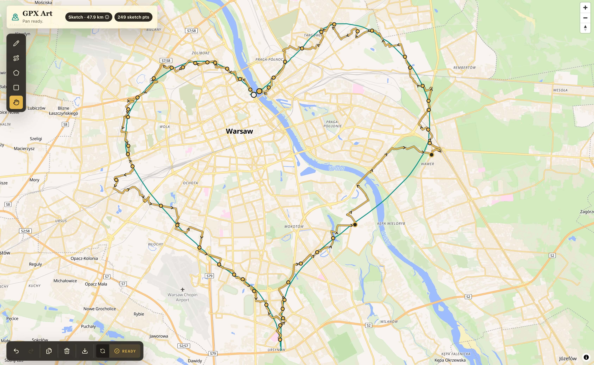

# GPX Art

GPX Art is a browser-based sketch-to-route tool for cyclists. Draw a shape on the map, let the
app match it to bikeable roads, then download the resulting route as a GPX file.



## Features

- Draw with pencil, polyline, polygon, and rectangle tools, or pan the map.
- Plan sketches against a bicycle road network with Valhalla map matching.
- Optimize multiple sketch shapes into a single open route.
- Import and export sketch data as GeoJSON.
- Undo, redo, clear, and inspect the current sketch while drawing.
- Download a planned route as a GPX file.
- Use keyboard shortcuts for drawing tools and hold <kbd>Space</kbd> to temporarily pan.

## Development

GPX Art uses [pnpm](https://pnpm.io/). Install dependencies and start the development server:

```sh
pnpm install
pnpm dev
```

The app routes sketches through Valhalla. It uses the public Valhalla instance by default; to use
another instance, create a `.env` file with:

```sh
VALHALLA_BASE_URL=https://your-valhalla-instance.example
```

Useful development checks:

```sh
pnpm check
pnpm lint
pnpm test
```

## Production build

Create and preview a production build locally:

```sh
pnpm build
pnpm preview
```

## Built with

[SvelteKit](https://kit.svelte.dev/), [Svelte](https://svelte.dev/),
[TypeScript](https://www.typescriptlang.org/), [Tailwind CSS](https://tailwindcss.com/),
[MapLibre GL JS](https://maplibre.org/) and [Valhalla](https://valhalla.github.io/).
